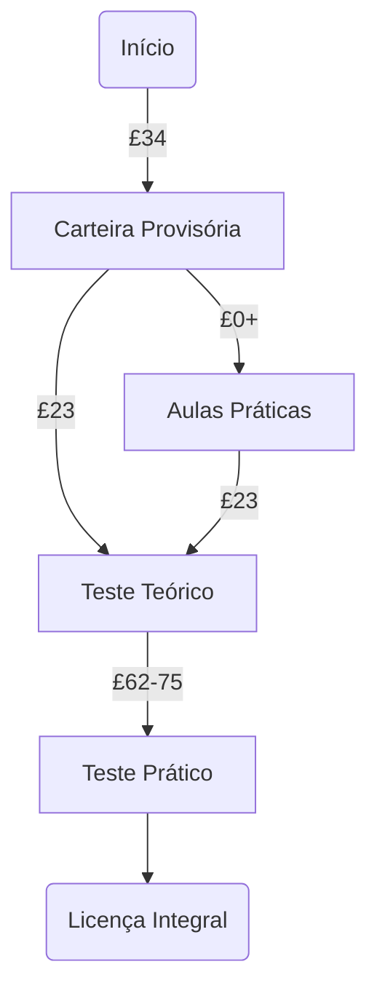
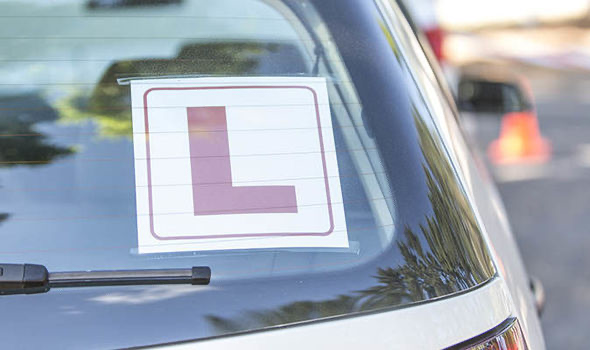

# Carteira de Motorista

Sua licença será emitida pelo DVLA (*Driver and Vehicle Licensing Agency*), o DETRAN local. Para o teste prático, [você precisa ter morado em um dos países do Reino Unido por ao menos 185 dias nos últimos 12 meses](https://www.gov.uk/book-driving-test).

## Carteira Provisória

Para ter aulas práticas (*driving lessons*) ou fazer o teste teórico (*theory test*), você precisa de uma carteira provisória (*provisional licence*). O custo varia dependendo da forma de como fará a aplicação: £34 se fizer online, £43 por correspondência. Fazendo o pedido online, você recebe a provisória por correspondência em uma semana.

## Aulas Práticas

Em posse da carteira provisória, você tem autorização de dirigir acompanhado para poder aprender e praticar para o teste. As aulas podem ser feitas [com instrutores autorizados](https://www.gov.uk/find-driving-schools-and-lessons) (pagos, com valor variável) ou [familiares/amigos](https://www.gov.uk/driving-lessons-learning-to-drive/practising-with-family-or-friends). Você deve dirigir com uma placa indicando que ainda não está completamente habilitado a dirigir.

## Teste Teórico

O teste teórico custa £23 e inclui perguntas nas seguintes categorias:

* *The Highway Code*
* *Know your traffic signs*
* *Driving - the essential skills*

## Teste Prático

O teste prático custa £23 (dias da semana) ou £75 (noites, fins de semana e feriados bancários). Você receberá o resultado imediatamente após o teste.

## Licença Integral

Imediatamente após a aprovação no teste prático, você já está autorizado a dirigir. Você tem 2 anos para pedir sua licença integral, que deve receber dentro de 3 semanas.

## Referências

* https://www.gov.uk/learn-to-drive-a-car
* https://www.gov.uk/browse/driving/driving-licences
