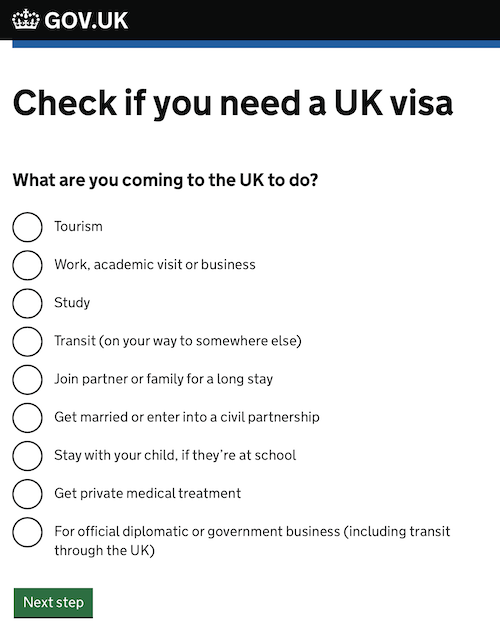

# Visto

O site do governo tem um excelente guia que, baseado em algumas perguntas, diz se você precisa ou não de um visto. Caso seja necessário, também mostra as opções disponíveis.

## Turismo

Brasileiros podem visitar o Reino Unido por até 6 meses sem a necessidade de visto. Prepare-se para responder perguntas sobre o motivo da sua visita e como pretende se manter. Na viagem, você precisará levar [os mesmos documentos necessários para a obtenção de um visto](https://www.gov.uk/government/publications/visitor-visa-guide-to-supporting-documents/guide-to-supporting-documents-visiting-the-uk).

## Residência

### Regime de Residência para União Europeia

::: tip
Em 31 de janeiro de 2020, o Reino Unido saiu formalmente da União Europeia - o _Brexit_.

Até 31 de dezembro de 2020, estamos no perído de transição, quando ambas as partes negociam acordos para o futuro. A menos que seja assinado algum acordo que mude o plano atual, tudo seguirá como descrito a seguir.
:::

Cidadãos da Suíça ou países da União Europeia (EU) ou do Espaço Econômico Europeu (EEA) têm condições especiais devido ao _Brexit_.

#### Até o fim do período de transição

Cidadãos destes países ainda têm a possibilidade de aplicar para residência permanente (_permanent residence document_ ou _EU resident document_). No entanto, este não será mais válido com o fim do período de transição. Por isso, você deve aplicar para o método seguinte ainda em 2020.

##### Referências

- https://www.gov.uk/permanent-residence-document-eu-eea

#### Após o período de transição

Com o fim do período de transição, cidadãos destes países devem aplicar para o regime de residência para União Europeia (_EU Settlement Scheme_).

Ao aplicar, você receberá um status de residência: _settled_ ou _pre-settled_. Para receber _settled_, você já precisa ter residido no Reino Unido por 5 anos ininterruptos. Caso não cumpra este requisito, você receberá um status de _pre-settled_. Este último lhe dará permissão de residência por 5 anos.

::: tip
[De acordo com o site do governo](https://www.gov.uk/settled-status-eu-citizens-families), familiares aplicáveis à [Permissão para Reunião Familiar](#permissao-para-reuniao-familiar-regime-de-residencia-para-uniao-europeia) podem entrar no mesmo pedido.
:::

A aplicação é gratuita e pode ser feita [pelo site](https://www.gov.uk/settled-status-eu-citizens-families/applying-for-settled-status). A decisão toma em média 5 dias úteis.

Com qualquer um dos dois status, você pode:

- trabalhar no Reino Unido
- usar o serviço nacional de saúde (NHS) gratuitamente
- estudar
- usar recursos públicos como pensões e outros benefícios
- viajar para dentro e fora do Reino Unido (com o status de _settled_, você pode permanecer 5 anos fora; caso contrário, são apenas 2 anos)

##### Referências

- https://www.gov.uk/settled-status-eu-citizens-families

### Permissão para Reunião Familiar - Regime de Residência para União Europeia

::: tip
Caso a visita seja de menos de 6 meses, é considerada como [turismo](#turismo). Essa permissão, apesar de também ter 6 meses de validade, pode valer a pena por facilitar entradas e saídas neste período. É gratuita e tem aplicação simples online.
:::

Se você pretende morar temporariamente no Reino Unido junto de um familiar europeu com regime de residência para União Europeia (_EU Settlement Scheme_), você provavelmente tem direito a aplicar para o _family permit_.

O familar deve ser, além de cidadão da Suíça ou de país do Espaço Econômico Europeu (EEA), ser considerado "próximo" (cônjuge ou filhos/pais dependentes).

A aplicação é gratuita e pode ser feita online. São necessários:

- passaporte
- documento evidenciando a relação com familiar
- código de aplicação para regime de residência para União Europeia (_EU Settlement Scheme application number_) do familiar
- se aplicável, documento evidenciando dependência do familiar

#### Referências

- https://www.gov.uk/check-uk-visa/y/brazil/family
- https://www.gov.uk/family-permit/eu-settlement-scheme-family-permit
- https://visas-immigration.service.gov.uk/apply-visa-type/eea
- https://www.gov.uk/family-permit/stay-after-your-family-permit-expires

### Reunião Familiar

Se seu familiar não se encaixa no caso anterior, você pode aplicar para o visto de reunião familiar (_family visa_). Custa de £1,033 a £3,250 por pessoa no pedido. A decisão é definida em 8-12 semanas.

#### Referências

- https://www.gov.uk/uk-family-visa
